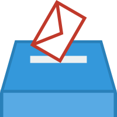

# [Unanym - Système de Vote Anonyme à l'Unanimité](https://unanym.1000i100.fr/)

Unanym est une application web simple qui permet de créer et mener des votes à l'unanimité. L'application ne nécessite aucune inscription et conserve l'anonymat des participants.

## Principe de fonctionnement

Unanym permet de créer un vote avec deux options :
- Une option qui nécessite l'unanimité pour être adoptée
- L'autre (véto) qui sera choisie dès lors qu'au moins une personne la choisie.

Chaque vote peut également être contesté, ce qui crée automatiquement un nouveau vote.

## Caractéristiques

- Pas d'inscription requise
- Votes totalement anonymes
- Partage facile par URL
- Périodes de contestation configurables
- Option pour masquer les résultats pendant la période de contestation
- Images et balises Open Graph pour un meilleur affichage des liens partagés sur forum ou réseaux sociaux

## Installation

### Prérequis

- Serveur web avec PHP 8.0+
- SQLite 3
- Extension PHP pour SQLite (pdo_sqlite)
- Extension PHP intl (pour le formatage des dates)
- Extension PHP BCMath (pour la génération des identifiants Base58)

### Étapes d'installation

1. Clonez ce dépôt dans votre serveur web :
   ```
   git clone https://github.com/1000i100/unanym.git
   ```

2. Assurez-vous que le répertoire est accessible en lecture et écriture par le serveur web :
   ```
   chmod 755 unanym
   ```

3. Accédez à l'application via votre navigateur :
   ```
   http://votre-domaine.com/unanym/
   ou
   https://unanym.votre-domaine.com/
   ```

4. Vérifiez votre installation en exécutant le script de test :
   ```
   php setup.php
   ```
   Ce script vérifiera :
   - La compatibilité de votre version de PHP
   - Les extensions PHP requises
   - Les droits d'accès au répertoire
   - La possibilité de créer/modifier la base de données

5. La base de données sera créée automatiquement lors de la première utilisation.

### Configuration pour serveur Apache ou NGINX

Un fichier `.htaccess` est inclus pour la configuration d'Apache. Si vous utilisez NGINX, consultez le fichier `_nginx_vhost_conf_example.conf`.

## Utilisation

1. Sur la page d'accueil, cliquez sur "Créer un Vote"
2. Configurez votre vote :
   - Donnez un titre significatif
   - Définissez l'option nécessitant l'unanimité
   - Définissez l'option véto (adoptée au moindre vote)
   - Indiquez le nombre total de votants attendus
   - Configurez la période de contestation (de 5 minutes à "toujours")
   - Choisissez si les résultats sont visibles pendant la contestation
3. Partagez l'URL générée avec tous les participants
4. Les participants votent de manière anonyme
5. Une fois tous les votes reçus :
   - Si tous les votes sont unanimes, le choix unanime est adopté
   - Si au moins un vote est contre, le choix véto est adopté
6. Pendant la période de contestation, un participant qui n'a pas pu voter peut contester le résultat, ce qui crée automatiquement un nouveau vote

## Cas d'usage

Unanym est particulièrement adapté pour :
- Des décisions de groupe où la protection des minorités est importante
- Des choix s'éloignant du statu quo (option unanime) vs maintenir le statu quo (option véto)
- Tester de nouvelles idées qui nécessitent l'adhésion de tous
- Prendre des décisions sensibles où chacun doit avoir un droit de regard

Des exemples concrets sont présentés sur la page d'accueil.

## Version alternative "low-tech"

Une méthode alternative sans technologie est également présentée sur la page d'accueil, permettant de réaliser un vote similaire en présentiel, où les participants forment un cercle et se tiennent la main pour transmettre discrètement un signal d'opposition.

## Structure technique

Le projet est basé sur une architecture PHP simple :
- Fichiers HTML statiques pour la page d'accueil et le formulaire de création
- Système de templates pour l'affichage dynamique des votes
- Base de données SQLite pour le stockage des données
- Gestion dynamique des états de vote (ouvert, fermé, contesté)
- Calcul précis des périodes de contestation en UTC
- Script de vérification `setup.php` pour diagnostiquer les problèmes d'installation
- Images Open Graph générées à partir de sources SVG (`og-images/`)

### Régénération des images Open Graph

Si vous modifiez les images SVG dans le dossier `og-images/`, vous pouvez les reconvertir en PNG optimisés avec :

```bash
cd og-images
./convert.sh
```

Ce script :
- Détecte automatiquement les outils de conversion disponibles (`rsvg-convert`, `inkscape`, ou `imagemagick`)
- Convertit tous les fichiers SVG en PNG au format approprié (1200×630 pour rectangulaire, 1200×1200 pour carré)
- Optimise les PNG avec `optipng`, `pngcrush` et/ou `pngquant` si disponibles
- Affiche des instructions d'installation pour les outils manquants

**Outils recommandés (Debian/Ubuntu) :**
```bash
sudo apt install librsvg2-bin optipng pngcrush
```

## Sécurité

- Protection contre l'accès direct aux fichiers PHP
- Utilisation de requêtes préparées pour toutes les interactions avec la base de données
- Échappement des données utilisateur pour prévenir les attaques XSS
- Pas de stockage d'informations personnelles
- Suppression automatique de `setup.php` à la première utilisation réussie

## Licence

Ce projet est distribué sous licence libre AGPLv3. Vous êtes libre de l'utiliser, le modifier et le redistribuer selon les termes de la licence.

## Développement

Pour contribuer au projet :
1. Clonez ce dépôt
2. Effectuez vos modifications
3. Testez localement avec un serveur PHP
4. Soumettez une pull request

## Contact

Pour toute question ou suggestion, n'hésitez pas à [ouvrir une issue](https://github.com/1000i100/unanym/issues) sur le dépôt GitHub.

## Crédits

Auteur humain :
- [1000i100](https://github.com/1000i100)

Assistants IA :
- [Qwen3](https://huggingface.co/Qwen/Qwen3-235B-A22B)
- [Claude 3.7 Sonnet](https://claude.ai/)
- [Claude Code 4.5 Sonnet](https://claude.ai/claude-code)

IDE :
- [Zed](https://zed.dev/)
